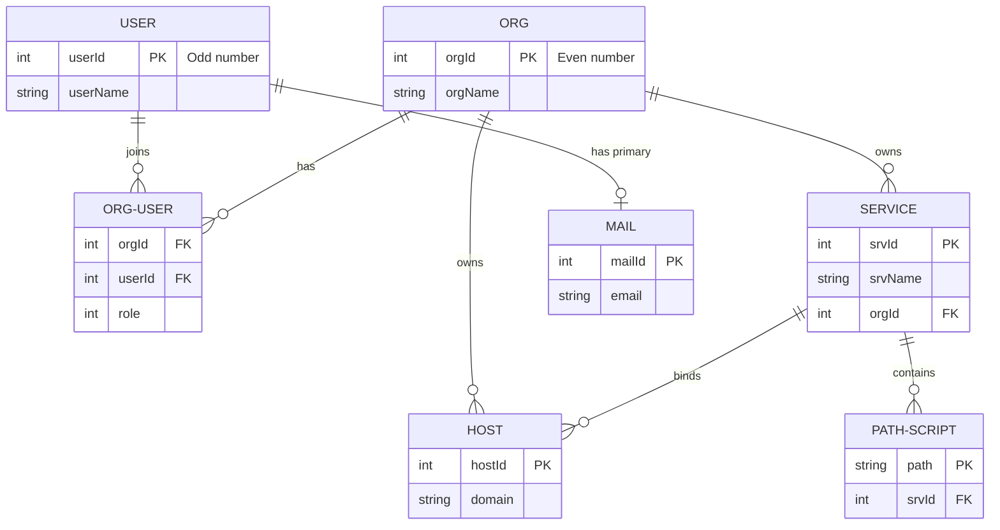

# WebC Redis 数据层设计文档

本文档梳理了 `srv/api/R` 目录下定义的所有 Redis 数据结构及其层级关系。

---

## 1. Redis 键结构汇总表

| 实体分类        | Redis 键 (Key)             | 数据类型 | 键格式说明                            | 值/成员/字段格式                                 | 业务用途说明                         |
| :-------------- | :------------------------- | :------- | :------------------------------------ | :----------------------------------------------- | :----------------------------------- |
| **用户 (User)** | `userId`                   | `string` | 计数器                                | `integer` (自增奇数)                             | 全局唯一用户 ID 计数器               |
|                 | `userName:[uid]`           | `string` | `userName:` + `u64Bin(uid)`           | `string` (用户名)                                | 根据用户 ID 查询用户名               |
| **组织 (Org)**  | `orgId`                    | `string` | 计数器                                | `integer` (自增偶数)                             | 全局唯一组织 ID 计数器               |
|                 | `orgId:[name]`             | `string` | `orgId:` + `orgName`                  | `integer` (组织 ID)                              | 根据组织名称查询组织 ID              |
|                 | `org:[org_id]`             | `string` | `org:` + `u64Bin(org_id)`             | `string` (组织名称)                              | 根据组织 ID 查询组织名称             |
|                 | `orgUser:[org_id]`         | `hash`   | `orgUser:` + `u64Bin(org_id)`         | Field: `u64Bin(uid)` Value: `u64Bin(role)`    | 组织成员列表及对应角色               |
|                 | `userOrg:[uid]`            | `zset`   | `userOrg:` + `u64Bin(uid)`            | Score: 最后访问时间戳 Member: `org_id`        | 用户加入的组织列表（按访问时间排序） |
|                 | `orgSrv:[org_id]`          | `zset`   | `orgSrv:` + `u64Bin(org_id)`          | Score: 最后修改时间戳 Member: `srv_id`        | 组织拥有的所有服务列表               |
|                 | `orgHost:[org_id]`         | `zset`   | `orgHost:` + `u64Bin(org_id)`         | Score: 最后修改时间戳 Member: `host_id`       | 组织绑定的所有域名列表               |
| **域名 (Host)** | `hostId`                   | `string` | 计数器                                | `integer`                                        | 全局唯一域名 ID 计数器               |
|                 | `hostId:[domain]`          | `string` | `hostId:` + `domain`                  | `integer` (域名 ID)                              | 根据域名字符串查询域名 ID            |
|                 | `idHost:[host_id]`         | `string` | `idHost:` + `u64Bin(host_id)`         | `string` (域名字符串)                            | 根据域名 ID 查询域名字符串           |
| **服务 (Srv)**  | `srv:[name]`               | `string` | `srv:` + `srvName`                    | `u64Bin(srv_id)`                                 | 根据服务名称查询服务 ID              |
|                 | `idSrv:[srv_id]`           | `string` | `idSrv:` + `u64Bin(srv_id)`           | `string` (服务名称)                              | 根据服务 ID 反查服务名称             |
|                 | `srvOrg:[srv_id]`          | `string` | `srvOrg:` + `u64Bin(srv_id)`          | `integer` (组织 ID)                              | 记录服务所属的组织 ID                |
|                 | `srvHost:[srv_id]`         | `zset`   | `srvHost:` + `u64Bin(srv_id)`         | Score: 最后修改时间戳 Member: `host_id`       | 服务绑定的所有域名列表               |
|                 | `srvJs:[srv_id]`           | `zset`   | `srvJs:` + `u64Bin(srv_id)`           | Score: 最后修改时间戳 Member: `path` (字符串) | 服务所拥有的路径脚本列表             |
| **邮箱 (Mail)** | `{mail}Id`                 | `string` | 计数器                                | `integer`                                        | 全局唯一邮箱 ID 计数器               |
|                 | `user{mail}:[uid]`         | `string` | `user{mail}:` + `u64Bin(uid)`         | `string` (邮箱地址)                              | 查询用户的主邮箱（直接存字符串）     |
|                 | `{mail}:[domain]:[prefix]` | `string` | `{mail}:` + `domain` + `:` + `prefix` | `u64Bin(mail_id)`                                | 邮箱地址查邮箱 ID                    |
|                 | `id{mail}:[mail_id]`       | `string` | `id{mail}:` + `u64Bin(mail_id)`       | `string` (`prefix@domain`)                       | 邮箱 ID 反查完整邮箱地址             |
|                 | `{mail}IdUser:[mail_id]`   | `string` | `{mail}IdUser:` + `u64Bin(mail_id)`   | `u64Bin(uid)`                                    | 邮箱 ID 查用户 ID                    |

---

## 2. 数据实体层级与关系 (ER Relationship)

---

## 3. 产品经理 (PM) 视角：现有设计缺失与改进建议

### 3.1 核心业务链路与特性说明

1. **ID 分配策略的业务耦合**
   - **现状**：用户 ID 强制奇数递增，组织 ID 强制偶数递增。
   - **问题**：将“类型信息”硬编码进 ID 生成逻辑虽然在特定场景下便于直接判别，但极大限制了后续实体类型的扩展（如引入“系统账号”、“部门”等新实体时无偶/奇可用），且使得 Redis 空间利用率减半。
   - **建议**：通过 Key 前缀（如 `usr:` 和 `org:`）天然隔离，ID 发生器保持各自独立连续自增即可。

### 3.2 缺失的关键业务属性

1. **服务（Service）的状态与元数据缺失**
   - **现状**：只有服务名和路径。
   - **缺失**：缺乏服务的“启停状态（Status）”、“最后更新人”、“版本号（Version）”、“环境变量（Environment Variables）”。这在多租户云平台中是核心功能。
2. **路径脚本（JsPath）的实体缺失**
   - **现状**：`srvJs` 只记录了路径列表（如 `/api/login`）。
   - **缺失**：实际脚本代码、配置、运行时参数（如内存上限、超时限制）存在哪里？如果存放在别处，Redis 应该有对应的 `script_id` 或 Hash 键进行关联。
3. **用户认证与安全凭证缺失**
   - **现状**：仅有用户名。
   - **缺失**：密码哈希、密码盐、MFA 状态、账号状态（激活/禁用/冻结）、最后登录 IP/时间。
4. **组织成员角色的细粒度控制缺失**
   - **现状**：`orgUser` 直接映射 `uid` -> `role`。
   - **缺失**：缺乏组织自定义角色（Role）与权限集（Permissions）的映射表。
5. **审计日志与操作记录（Audit Logs）**
   - **缺失**：对组织、服务、域名、脚本路径的修改缺乏操作记录。
